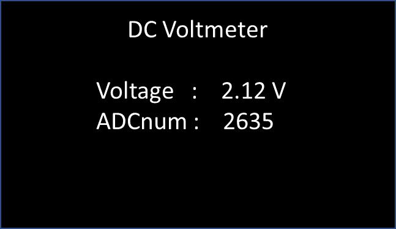
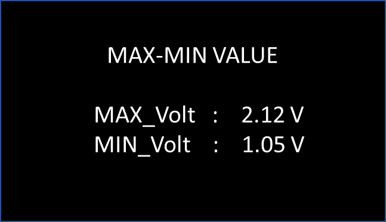
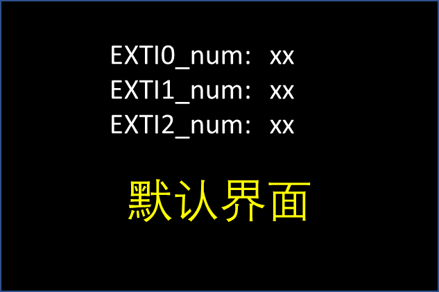
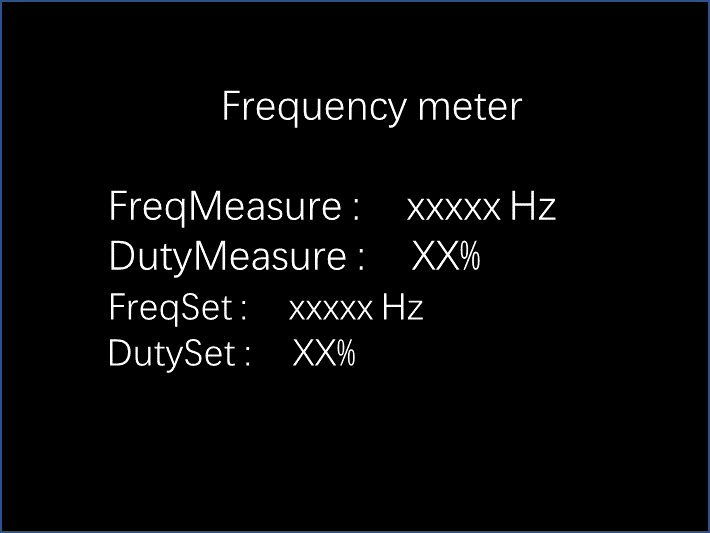

# Embedded_course_work

### 河南大学迈阿密学院20级嵌入式系统设计课程实验作业

1. 开发板：NUCLEO-F411RE
2. 扩展板：变阻器、LED×4、按键×4、UART排针、蜂鸣器、SPI排母、复位键
3. LCD：
   - ZJY169S0800TG01
   - port:4 WIRE: SPI
   - DEVICE IC ST7789V2
   - RESOLUTION: 240(RGB)×280

### 作业内容：

- 实验一：嵌入式开发软硬件平台使用

  要求：

  1. 正确创建一个新工程，合理配置GPIO与系统时钟，了解工程文件结构和代码框架，了解工程文件结构和代码框架。
  2. LED1和LED4常亮。
  3. LED2和LED3交替闪烁，间隔500ms。
  4. 实现其他自选创意功能。
- 实验二：GPIO基本操作

  要求：

  1. 正确创建一个新工程，合理配置GPIO与系统时钟。
  2. 初始化上电静默（关掉所有灯、蜂鸣器）。
  3. 通过KEIL编程实现以下功能按下B1流水灯向左循环（松手有效,间隔50ms）；按下B2键流水灯向右循环（按下开始，间隔500ms）；按下B3键，打开蜂鸣器；按下B4键，回到初始静默模式。
  4. 实现其他自选创意功能。
- 实验三：板级支持包的修改与添加

  要求：

  1. 利用cubemx 输出代码框架 自主设计LED、蜂鸣器、按键相关外设的BSP文件。
  2. 加载BSP层文件。
  3. 利用所设计、导入文件，完成实验二功能，并设计其他创意功能。
- 实验四：基于库函数的LCD操作

  要求：

  1. LCD相关驱动文件的载入；初始化。
  2. 清屏；设置背景色；设置字符颜色。
  3. LCD屏幕第2行显示蓝底白字: ID：学号。
  4. LCD屏幕第2行显示蓝底白字:  Embedded system Lab 4。
  5. LCD屏幕第3行显示循环24s倒计时;  白底红字 Time left: xx s。
  6. （选做）倒计时<=5s时，第4行和第5行闪烁，以250ms闪烁红色和蓝色；ok。
  7. 第五行以下，蓝底白图，按下K1 K2 K3 K4依次实现功能，画出圆形、画出方形、画三角形、清6789行等功能。
- 实验五：基于HAL库的ADC配置与应用

  要求：

  1. 初始化PB15管脚为ADC输入端口；
  2. 导入LCD、LED、KEY相关BSP文件；
  3. 显示默认界面1；按下K1显示界面1、2切换；
  4. LED的亮灯数量粗略指示输出电压值。
  5. 创新：提升测量准确度和精度 或其他。
  6. 
- 实验六：基于HAL库的外部中断配置与应用

  要求：

  1. PB0、 PB1、 PB2为外部中断模式 ，中断优先级分别为123。
  2. 导入LCD、LED相关BSP文件。
  3. LCD显示默认界面： EXTI0、 EXTI1 、 EXTI2发生次数 。

     
  4. EXTI0 触发LED1234亮2s、 EXTI1 触发LED5678亮2s 。如果其中一个触发次数多于另一个4次，则触发另一个的软中断开启一次。
  5. EXTI2控制左向流水灯流速；设置为3档。
  6. 设计其他创意功能。
- 实验七：基于HAL库的定时器配置与用

  要求：

  1. 利用电位器R37调整LED1的亮度。思路：配置PB15为ADC模式；配置PC8为PWM输出模式；配置PC9-15为高电平输出模式；利用ADC采样值调整PWM的占空比。
  2. 设计LED2实现呼吸灯。（渐亮渐暗）
- 实验八：基于HAL库的定时器配置与应用二

  要求：

  1. 设计一个输出频率和占空比均可调的PWM波形，在PA1输出，利用电位器R37、R38分别调整频率和占空比。
  2. 配置PA6引脚为频率计输入端，可同时测量频率和占空比。
  3. 屏幕上显示频率、占空比的测量值和设定值。效果如下图。

     
  4. 实现其他感兴趣的内容。
- 实验九：基于HAL库的UART配置与应用

  要求：

  1. 实验1
     1. 串口重定向，便于交互。
     2. DMA模式收发数据；实现数据的任意长度接收。
     3. 如果接收到的指令，则执行指令动作。（开关任意个数LED）
        指令格式：以#LED开头，onLEDx/offLEDx开关第x个小灯。指令可以任意组合。
     4. 如果接收到非动作指令，展示接收到的数据，并给出命令提示。
     5. 串口助手自由选择合适的。
  2. 实验2
     1. 利用scanf printf 进行交互，复位打印指令提示。
     2. 按下Key1，上位机输出name: 等待输入姓名信息。
     3. 按下Key2，上位机输出age:    等待键盘输入姓名信息。
     4. 按下Key3，上位机输出This is  xx, xx years old。
- 课程设计：基于STM32F411的LCD驱动设计与LVGL图形库应用: 显示优化与示波器设计
